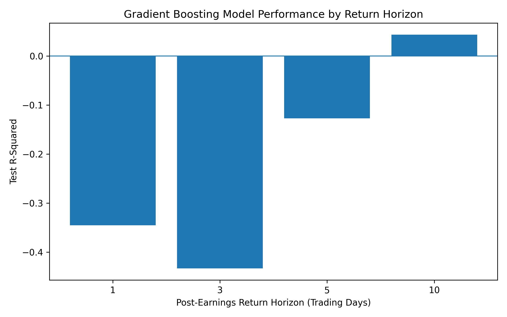
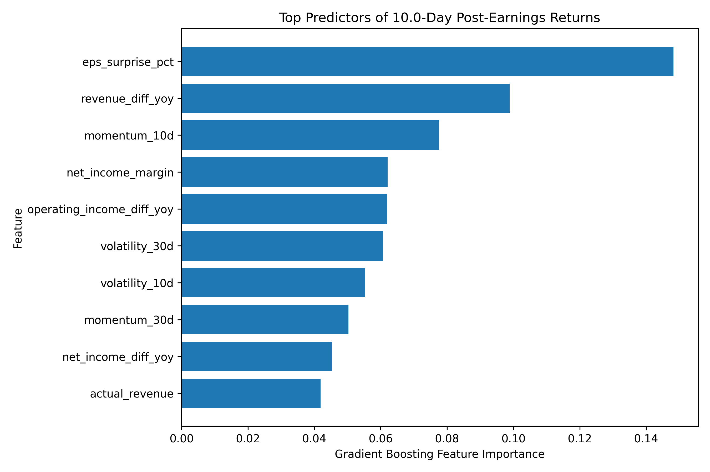

# Earnings Euphoria or Empty Signal? A Data-Driven Breakdown of What Really Moves Big Tech Stocks After the Bell

## Hook

With billions of dollars riding on earnings season, investors constantly ask: *Can we predict how stock prices will move after earnings announcements?* Using data from the Magnificent 7, we set out to find the answer.

## Problem Statement

Earnings announcements are among the most anticipated events in financial markets, often triggering sharp movements in stock prices. Investors rely on metrics like earnings per share (EPS), revenue growth, and market momentum to guide their decisions. However, it remains unclear whether these widely followed indicators actually provide predictive insight into how stock prices will behave in the days following earnings releases.

This project investigates whether pre-earnings market behavior and reported financial performance can meaningfully explain short-term stock price reactions across multiple time horizons (1, 3, 5, and 10 trading days).

## Solution Description

To address this question, we constructed a dataset combining financial statement data from SEC filings with market data from Yahoo Finance for the Magnificent 7 companies. Using this dataset, we trained a Gradient Boosting model to evaluate how well various features—such as EPS surprises, revenue growth, momentum, and volatility—can predict post-earnings stock returns.

The analysis was conducted across multiple time horizons to determine when, if at all, these factors begin to show predictive power. By examining both model performance and feature importance, we identified not only *if* predictions are possible, but also *which factors matter most*.

## Chart(s)

### Model Performance by Return Horizon

### Additional Insight: What Drives Returns?

### Final Takeaway:

Our findings largely support the Efficient Market Hypothesis, as stock prices appear to incorporate earnings information almost immediately, leaving little predictable structure in short-term returns. Any limited predictability that emerges over longer horizons suggests only minor delays in how information is fully absorbed by the market.
